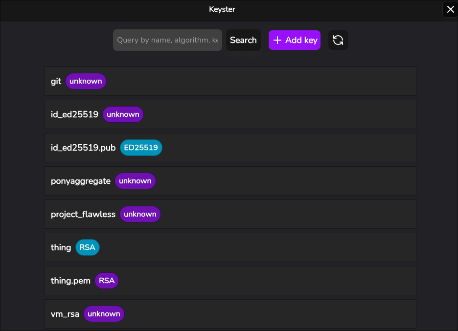
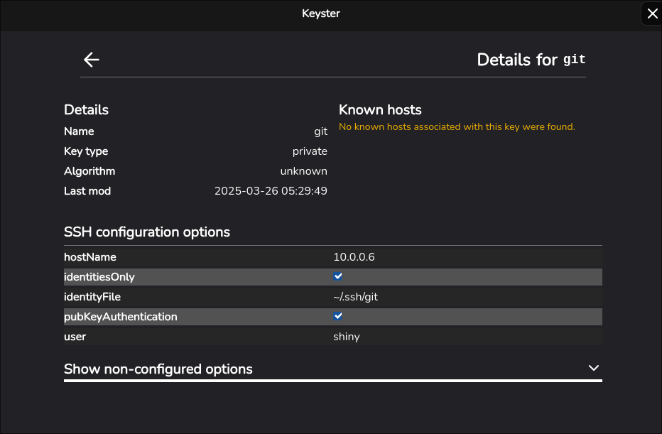
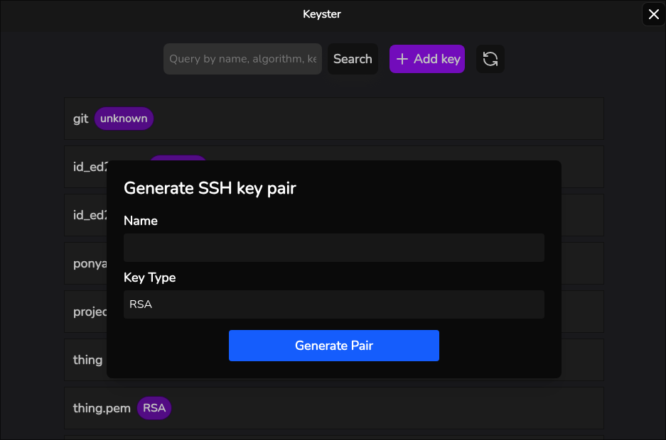

# Keyster
[](https://go.dev)
[](https://wails.io)
[](https://opensource.org/licenses/MIT)

**Keyster** is a graphical SSH key and ssh_config manager for Linux built with Go, Wails, and React.

## Screenshots

<details>
  <summary>Details View</summary>



</details>

<details>
  <summary>Key Information Page</summary>



</details>

<details>
  <summary>Generate Key</summary>



</details>

## Features

- View and search for keys located in `~/.ssh`
- View and modify `ssh_config` options for each key
- View known hosts for a given key
- Upload keys to `~/.ssh`
- Generate RSA keys from UI

### Todo
- [ ] Add support for comma-separated lists in host config

## Prerequisites
- **Go** (1.27 recommended)
- **Wails CLI** (`go install github.com/wailsapp/wails/v2/cmd/wails@latest`)
- **Webkit2GTK**: `libwebkit2gtk-4.1-dev` (or `4.0` for legacy systems)

## Installation

### Release

To install the latest stable release of Keyster, visit the [releases page](https://github.com/compscitwilight/keyster/releases/latest) to download the binary.

For an express installation, run the following command:
```sh
curl -sSL https://raw.githubusercontent.com/compscitwilight/keyster/main/install.sh | bash
```

### Build

In order to manually build and run Keyster manually, use the following commands:

```sh
# create a clone repo
git clone https://github.com/compscitwilight/keyster
cd keyster

# build
go mod download
wails build -tags webkit2_41

# run
./build/bin/keyster &
```

> [!NOTE]
> `webkit2_41` is used for GTK version 4.1. If you are running a legacy GTK version (i.e. `libwebkit2gtk-4.0` on Ubuntu 20.04, Debian 11, etc), use `wails build -tags webkit2_40` instead.
